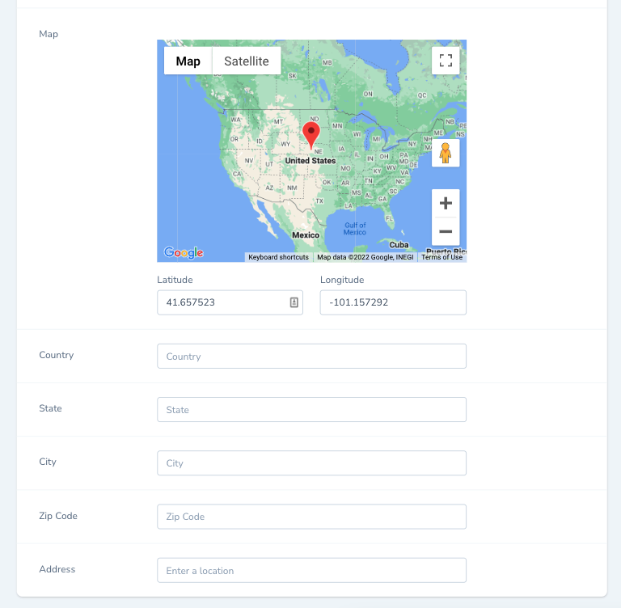

# Nova Google Map With Autocomplete Field Package

This field allows you to work with Google Places API to autocomplete and Google Map on user input and get the full real address with all the metadata (like latitude and longitude).

## Installation

You can install the package in to a Laravel app that uses Nova via composer:

```bash
composer require trinityrank/google-map-with-autocomplete
```

Now publish config and localization files:

```shell
php artisan vendor:publish --provider="Trinityrank\GoogleMapWithAutocomplete\FieldServiceProvider"
```

Create an app and enable Places API and create credentials to get your API key
[https://console.developers.google.com](https://console.developers.google.com)

Add the below to your `.env` file

```shell
GMAPS_API_KEY=############################
```

## Usage

Add the use declaration to your resource and use the fields:

```php
use Trinityrank\GoogleMapWithAutocomplete\TRMap;
use Trinityrank\GoogleMapWithAutocomplete\TRCountry;
use Trinityrank\GoogleMapWithAutocomplete\TRState;
use Trinityrank\GoogleMapWithAutocomplete\TRCity;
use Trinityrank\GoogleMapWithAutocomplete\TRZipCode;
use Trinityrank\GoogleMapWithAutocomplete\TRAddress;

TRMap::make('Map'), // Google Map with address picker
TRCountry::make('Country'), // Country field
TRState::make('State'), // State field
TRCity::make('City'), // City field
TRZipCode::make('Zip Code'), // Zip Code Filed
TRAddress::make('Address'), // Autocomplete address field
```

Add the use declaration to your resource and use the panel with all fileds:

```php
use Trinityrank\GoogleMapWithAutocomplete\TRLocation;

TRLocation::make('Location'), // All fileds in panel with required rule
```



### Customize Fields

Add custom latitude, longitude and zoom values for starting point

```php
TRMap::make('Map')
    ->latitude('latitude')
    ->longitude('longitude')
    ->zoom('zoom'),
```

Hide latitude and longitude field

```php
TRMap::make('Map')
    ->hideLatitude()
    ->hideLongitude(),
```

You can add any nova basic methods to fileds (Showing / Hiding, Validation ... ).